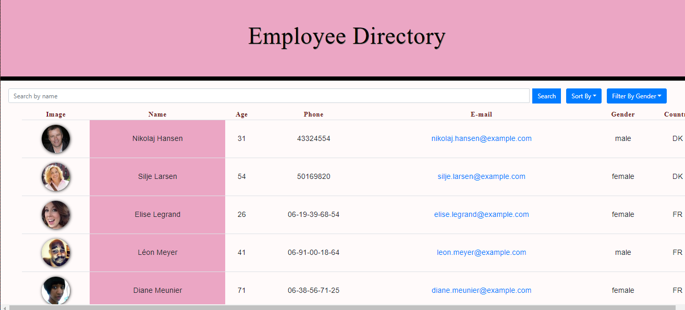
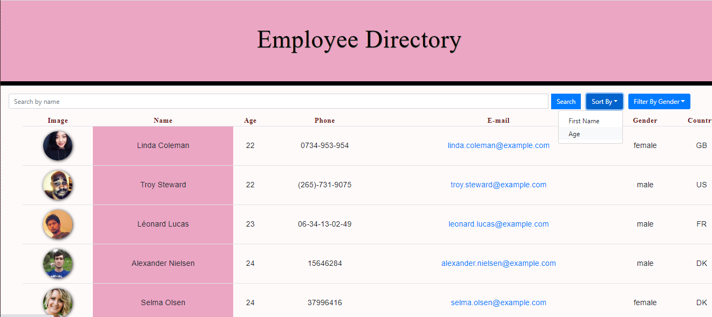

# Employee-Directory
An Employee Directory application built using React components.
The application manages component states and responds to user events.

### Deployed Heroku URL
Click here to see live app: 

## Table of Contents
   * [User Story](#user-story)
   * [Acceptance Criteria](#acceptance-criteria)
   * [Description](#description)
   * [Usage](#usage)
   * [Built with](#built-with)
   * [Installation](#installation)
   * [Badges](#badges)
   * [Contributing](#contributing)
   * [License](#license)
   * [Tests](#tests)
   * [Visuals](#visuals)

## User Story
```
* As a user, 
* I want to be able to view my entire employee directory at once so that I have quick access to their information.

```
## Acceptance Criteria
```
Given a table of random users, when the user loads the page, a table of employees should render. 

The user should be able to:

  * Sort the table by at least one category

  * Filter the users by at least one property
```

## Description
Primary goal of app is to use React for the first time. The app takes in a set of random employees from the API Random User Generator (randomuser.me). It stores the random employees in context. The employees are mapped over and displayed in a table format. 

### features
The WebApp complies to following features. These are as follows -

* The user is able to search by the users first name with the search input.

* The user is able to sort the employees by first name or age by clicking on either of these options in the sort by dropdown menu.

* The user is also able to filter the employees by gender by clicking on either male or female options in the filter by dropdown menu.

This project was bootstrapped with Create React App.
This app utilizes an API to populate random users and then create a directory. Other users on the app can search for employees by "name" and also organize each field (Name, Email, Age, Phone, Gender and Country). The names are always sorted in ascending order

## Badges
[](https://img.shields.io/github/followers/sujatha-m?style=social)
[](https://img.shields.io/website?url=https%3A%2F%2Fsujatha-m.github.io%2FWeather-Dashboard%2FDevelop%2F)


## Visuals






## Built with
* React.js
* React-dom
* React-bootstrap
* Axios
* NodeJS
* Node Packages:
* Randomuser API

## Installation 
Run npm install to install all dependencies.
npm run start or npm start.
Runs the app in the development mode.
Open http://localhost:3000 to view it in the browser.
The page will reload if you make edits. You will also see any lint errors in the console.

The Employee Directory app is live on Heroku for you to use as well.

## Usage
```sh
     npm start or npm run start
```

## Contributing
Pull requests are welcome. For major changes, please open an issue first to discuss what you would like to change.
Please make sure to update tests as appropriate.


## License 
[](https://img.shields.io/npm/l/isc?color=Blue&style=plastic)

## Questions
# 

jhanavi.bhushan@gmail.com
